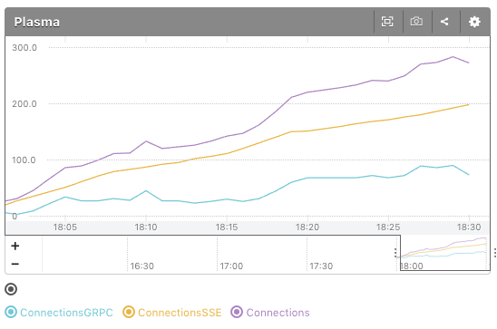

plasma-mackerel-plugin
===========

[](https://circleci.com/gh/openfresh/plasma-mackerel-plugin)
[](https://golang.org/)
[](https://github.com/openfresh/plasma-mackerel-plugin/issues?state=open)
[](LICENSE)


This mackerel plugin provides [Plasma](https://github.com/openfresh/plasma) connection metrics.

# Usage

## Install

```bash
$ go get github.com/openfresh/plasma-mackerel-plugin
```

## setting

You should locate binary of plasma-mackerel-plugin to any directory.

```
[plugin.metrics.plasma]
command = "/path/to/plasma-mackerel-plugin -host=127.0.0.1:9999"
```

## Graph



License
===
See [LICENSE](LICENSE).

Copyright © CyberAgent, Inc. All Rights Reserved.
